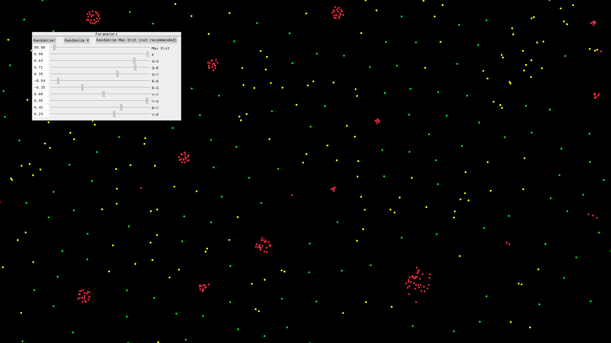

# particles



This project is inspired by [this](https://www.youtube.com/watch?v=0Kx4Y9TVMGg) YouTube video,
which demonstrates how easy it is to implement this system.

The described system consists of a bunch of particles that attract and repel each other,
based on some values (which you can randomize), tweakable through some sliders.
If you experiment a little bit, you will notice that with some specific values
a lot of very interesting patterns and structures emerge.

## Run

To run the program, simply clone the repository and run

```bash
cargo run --release
```

## TODO list

- investigate over particles going off screen somehow
